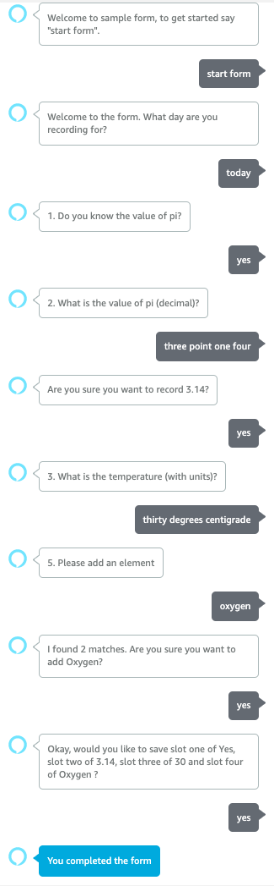

# Alexa Form SDK Template

This is the Alexa skill template for [ask-form-sdk](https://github.com/aws-samples/ask-form-sdk).

## Getting started

### Using the template

Use the ASK CLI to [Create a new skill](https://developer.amazon.com/en-GB/docs/alexa/smapi/ask-cli-intro.html#create-new-skill) with a template-url:

```
ask new --template-url https://github.com/aws-samples/ask-form-template.git
```

You are prompted to choose a method to host your skill's backend resources:

* `Alexa-hosted-skills` (Do not choose this)
* `AWS with CloudFormation` (Choose this to for AWS Lambda with persistence to Amazon DynamoDB)
* `AWS Lambda` (Choose this if you want to deploy to AWS Lambda without AWS CloudFormation)

You will then be warned you about downloading an unofficial template.

Input **Yes** to continue provide a skill name eg. `my-survey`.

```
? Choose a method to host your skill's backend resources:  AWS with CloudFormation
[Warn]: CLI is about to download the skill template from unofficial template https://github.com/aws-samples/ask-form-template.git. Please make sure you understand the source code to best protect yourself from malicious usage.
? Would you like to continue download the skill template?  Yes
? Please type in your skill name: my-survey
? Please type in your folder name for the skill project (alphanumeric):  my-survey
```

Change into your project directory, and list the contents.  You will see the template includes a `lambda` folder with a samples `forms` folder used to generate skill interaction model, as well as `infrastructure` to deploy cloud formation if required.

```
$ cd my-survey
$ tree
.
├── LICENSE.txt
├── README.md
├── ask-resources.json
├── infrastructure
│   └── cfn-deployer
│       └── skill-stack.yaml
├── lambda
│   ├── forms
│   │   └── index.js
│   ├── index.js
│   └── package.json
└── skill-package
    ├── assets
    │   ├── en-US_largeIcon.png
    │   └── en-US_smallIcon.png
    ├── interactionModels
    │   └── custom
    │       └── en-US.json
    └── skill.json
```

You will then be able to deploy this skill into your AWS account.  By default this will be deployed to the `us-east-1` region.

- Update the `.ask-resources.json` to specify a different region.

```shell
$ ask deploy
```

The default invocation is "my survey". Once your skill is deployed, you can [test your skill](https://developer.amazon.com/en-US/docs/alexa/devconsole/test-your-skill.html) in the Alexa developer console.

Following is an example conversation.



### Troubleshooting

- If you are getting the following error during ```ask deploy```, then you already have the dynamo db table created with the name my-survey :
```
[Error]: The CloudFormation deploy failed for Alexa region "default": AlexaPersistentAttributesTable[AWS::DynamoDB::Table]  DELETE_COMPLETE(Resource deleted. For detailed reasoning, please check the "events" tab in the AWS console for CloudFormation stackId <STACK-ID>)
```
To resolve this issue you can fo to my-survey/infrastructure/cfn-deployer/skill-stack.yaml and change the name of the ```PersistentAttributeTableName``` default value from my-survey.
- If you are getting the following CLI error during deployment, it might be due to the ask profile settings ;
```
[Error]: CliError: Skill package src is not found in ask-resources.json.
```
Go to my-survey/ask-resources.json and check the profile to see if the profile used for deployment is present in this. If not add the profile use for deployment to this file.

